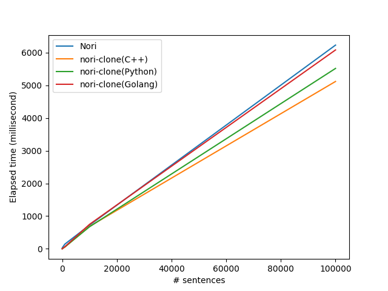

# nori-clone

Standalone Nori (Korean Morphological Analyzer in Apache Lucene) written in C++.

## Introduction

ElasticSearch provides high-quality/performance Korean morphological analyzer `nori`. But `nori`'s code is strongly coupled with the Lucene codebase, and `nori` is written in Java that is the main language in the Lucene project. So, it's hard to use `nori` standalone in Python or Golang with the same performance. Therefore, I re-implemented almost the same algorithms with `nori` in Lucene using C++ for the portability and usability.

## Usage

This project is written in C++, but also provides Python and Golang binding.

* [C++ docs](./nori/lib/README.md)
* [Python docs](./nori/python/README.md)
* [Golang docs](./nori/go/README.md)

## Pre-built dictionaries

A `dictionary/` directory is for the pre-built dictionary files that is used for distribtion and test cases. For now, there are two pre-built dictionaries, `lagacy` and `latest`.

* `legacy` dictionary does not normalize inputs, and built with `mecab-ko-dic-2.0.3-20170922` that is same with original nori.
* `latest` dictionary normalizes the inputs with the form NFKC, and built with `mecab-ko-dic-2.1.1-20180720`.

## Performance

For more details, check out [tools/benchmark](./tools/benchmark/README.md)

## For the contributors

Check out [CONTRIBUTING.md](./CONTRIBUTING.md)

## References

* <https://www.elastic.co/kr/blog/nori-the-official-elasticsearch-plugin-for-korean-language-analysis>
* <https://github.com/apache/lucene/tree/main/lucene/analysis/nori>
* <https://gritmind.blog/2020/07/22/nori_deep_dive/>
* <https://github.com/gritmind/python-nori>
