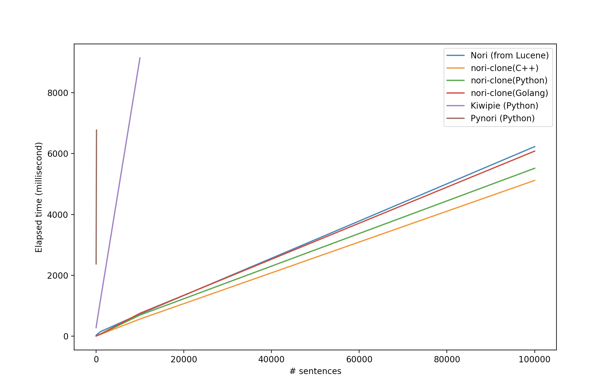

# Benchmark



Environment:

```text
Monterey 12.1
MacBook Pro (13-inch, 2020, Four Thunderbolt 3 ports)
2 GHz QuadCore Intel Core i5
16GB 3733 MHz LPDDR4X

Python 3.8.12
kiwipiepy==0.10.3
kiwipiepy-model==0.10.0
pynori==0.2.4

openjdk 14.0.1 2020-04-14
OpenJDK Runtime Environment (build 14.0.1+7)
OpenJDK 64-Bit Server VM (build 14.0.1+7, mixed mode, sharing)

go version go1.17.6 darwin/amd64

Apple clang version 13.0.0 (clang-1300.0.29.30)
Target: x86_64-apple-darwin21.2.0
Thread model: posix
```
